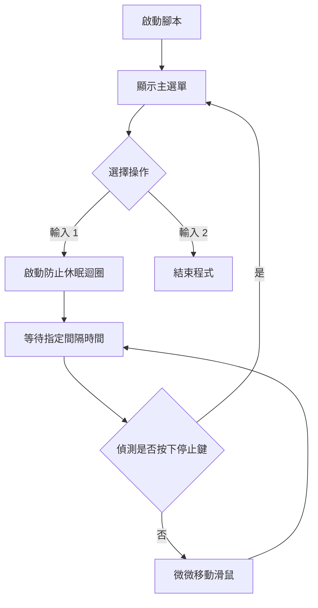
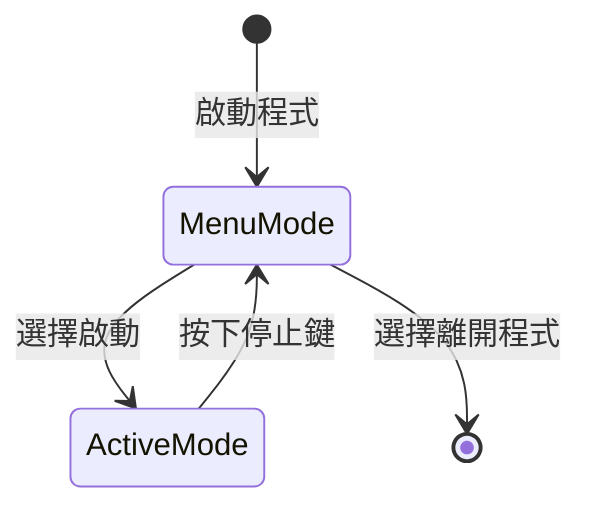

# AntiScreenSaver 規格文件

## 1. 架構與選型
- **作業系統**: Windows
- **語言**: PowerShell 7+
- **依賴**: 無外部模組，將使用內建 C# API `System.Windows.Forms.Cursor` 或 P/Invoke `user32.dll` 來進行滑鼠操作。
- **設計模式**: 雖然是單一腳本，我們將方法模組化封裝，符合單一職責原則 (SRP)。

## 2. 關鍵流程
1. 使用者執行腳本。
2. 顯示選單介面：
   - 1) 啟動防螢幕保護 (Start)
   - 2) 結束程式 (Exit)
3. 選擇 1 後，啟動無窮迴圈，每隔固定時間 (預設 2 分鐘) 移動滑鼠，確保系統不會被判定為閒置。
4. 迴圈執行期間，偵測使用者是否按下特定鍵(例如：`Esc` 或 `Q`) 來停止迴圈並回到主選單。

## 3. 流程圖


## 4. 狀態圖


## 5. 虛擬碼
```powershell
function Show-Menu {
    # 列印選單
    # 讀取使用者輸入 (1 或 2)
}

function Move-MouseToPreventSleep {
    # 取得當前座標
    # 移動 +1, +1
    # 延遲幾毫秒
    # 移回原位
}

function Start-AntiIdleLoop {
    # while ($true) {
    #    if (Console.KeyAvailable 且是中斷鍵) { break }
    #    等待指定間隔
    #    Move-MouseToPreventSleep()
    # }
}

# Main Application Entry
```
